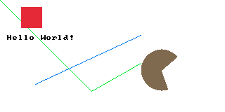

# pntr_brush

Brush API for [pntr](https://github.com/RobLoach/pntr), inspired by [Cairo](https://en.wikipedia.org/wiki/Cairo_(graphics)), [Skia](https://skia.org), or [Canvas](https://www.w3schools.com/html/html5_canvas.asp).

## Example

``` c
#define PNTR_BRUSH_IMPLEMENTATION
#include "pntr_brush.h"

// ..

pntr_image* image = pntr_gen_image_color(320, 160, PNTR_WHITE);
pntr_brush* brush = pntr_load_brush(image);
pntr_brush_font(brush, font);

pntr_brush_begin_path(brush);
brush->strokeStyle = PNTR_GREEN;  // This path is green.
pntr_brush_move_to(brush, 0, 0);
pntr_brush_line_to(brush, 130, 130);
pntr_brush_line_to(brush, 200, 90);
pntr_brush_stroke(brush);

pntr_brush_begin_path(brush);
brush->strokeStyle = PNTR_BLUE;  // This path is blue.
pntr_brush_move_to(brush, 200, 50);
pntr_brush_line_to(brush, 50, 120);
pntr_brush_stroke(brush);

pntr_brush_fill_style(brush, PNTR_RED);
pntr_brush_fill_rect(brush, 30, 10, 30, 30);

pntr_brush_begin_path(brush);
brush->fillStyle = PNTR_BROWN;
pntr_brush_move_to(brush, 230, 100);
pntr_brush_arc(brush, 230, 100, 30, 70, 320, 500);
pntr_brush_fill(brush);

brush->fillStyle = PNTR_BLACK;
pntr_brush_fill_text(brush, "Hello World!", 10, 50);

pntr_unload_brush(brush);
```



## API
``` c
// Brush methods
pntr_brush* pntr_load_brush(pntr_image* dst);
void pntr_unload_brush(pntr_brush* brush);
void pntr_brush_reset(pntr_brush* brush);

// Drawing methods
void pntr_brush_fill_rect(pntr_brush* brush, int x, int y, int width, int height);
void pntr_brush_stroke_rect(pntr_brush* brush, int x, int y, int width, int height);
void pntr_brush_clear_rect(pntr_brush* brush, int x, int y, int width, int height);
void pntr_brush_stroke_text(pntr_brush* brush, const char* text, int posX, int posY);
void pntr_brush_fill_text(pntr_brush* brush, const char* text, int posX, int posY);
void pntr_brush_draw_image(pntr_brush* brush, pntr_image* image, int posX, int posY);
void pntr_brush_fill(pntr_brush* brush);
void pntr_brush_stroke(pntr_brush* brush);
void pntr_brush_arc(pntr_brush* brush, int centerX, int centerY, float radius, float startAngle, float endAngle, int segments);

// Path methods
void pntr_brush_begin_path(pntr_brush* brush);
void pntr_brush_move_to(pntr_brush* brush, int posX, int posY);
void pntr_brush_line_to(pntr_brush* brush, int posX, int posY);
void pntr_brush_rect(pntr_brush* brush, int x, int y, int width, int height);
void pntr_brush_close_path(pntr_brush* brush);
void pntr_brush_save(pntr_brush* brush);
void pntr_brush_restore(pntr_brush* brush);

// Property methods
void pntr_brush_line_width(pntr_brush* brush, int lineWidth);
void pntr_brush_stroke_style(pntr_brush* brush, pntr_color color);
void pntr_brush_fill_style(pntr_brush* brush, pntr_color color);
void pntr_brush_font(pntr_brush* brush, pntr_font* font);
int pntr_brush_measure_text(pntr_brush* brush, const char* text);
```

# License

[MIT](LICENSE)
